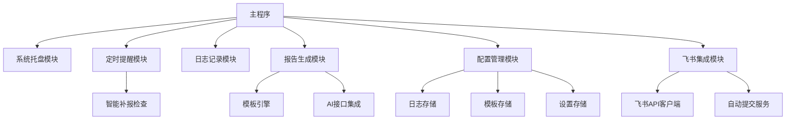
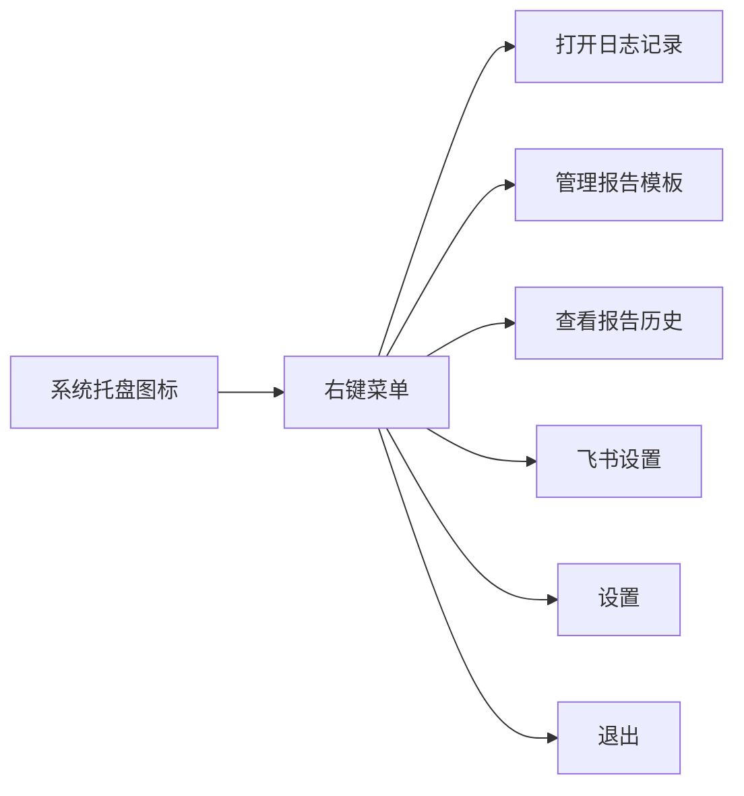

# 牛马日报助手 - 详细设计文档

## 1. 项目概述

牛马日报助手是一款为职场人士设计的桌面小工具，帮助用户轻松记录工作日志、定时提醒提交报告，并智能生成日报/周报/月报。工具运行在Windows系统后台，通过系统托盘常驻，提供便捷的工作日志管理功能。

## 2. 功能需求

### 2.1 核心功能

- **工作日志记录**：提供便捷的日志输入界面，按日期自动保存
- **定时提醒系统**：
  - 工作日17:15提醒日报
  - 周五17:15提醒周报
  - 月末提醒月报
- **报告生成**：基于模板和工作日志生成格式化报告
- **后台运行**：系统托盘常驻，不干扰用户工作

### 2.2 扩展功能

- 模板管理（日报/周报/月报）
- AI增强报告生成（可选）
- 报告历史记录查看
- 数据统计与分析
- **飞书集成**：自动提交报告到飞书平台
- **智能补报**：20点未手动生成日报时自动生成并提交

## 3. 系统架构

### 3.1 技术栈

| 组件 | 技术选型 |
|------|----------|
| GUI框架 | PyQt5 |
| 数据存储 | JSON格式配置文件 |
| 定时任务 | QTimer |
| 系统集成 | Windows系统托盘 |
| HTTP客户端 | requests |
| 飞书API | 飞书开放平台API v1 |

### 3.2 模块设计


## 4. 用户交互设计

### 4.1 系统托盘菜单


### 4.2 工作日志界面

```
+-----------------------------------+
|           工作日志记录             |
+-----------------------------------+
| [今日工作记录标签]                 |
| +-------------------------------+ |
| | 多行文本编辑区                 | |
| |                               | |
| |                               | |
| +-------------------------------+ |
| [保存按钮] [清空按钮]             |
+-----------------------------------+
```
### 4.3 提醒对话框

```
+-----------------------------------+
|           日报提醒                |
+-----------------------------------+
| 牛马要交日报了！                  |
|                                   |
| 今日工作记录：                    |
| +-------------------------------+ |
| | [日志内容预览]                 | |
| +-------------------------------+ |
|                                   |
| [生成报告] [稍后提醒] [确认]      |
+-----------------------------------+
```
### 4.4 报告生成界面

```
+-----------------------------------+
|        生成的日报报告             |
+-----------------------------------+
| +-------------------------------+ |
| | 报告编辑区                    | |
| |                               | |
| |                               | |
| +-------------------------------+ |
| [复制到剪贴板] [保存] [关闭]      |
+-----------------------------------+
```
## 5. 数据存储设计

### 5.1 配置文件结构

```json
{
  "work_logs": {
    "2025-07-18": "完成项目A的API设计\n修复了登录模块的BUG",
    "2025-07-17": "参加了团队会议\n编写了技术文档"
  },
  "templates": {
    "daily": "今日工作内容：\n{logs}\n\n遇到的问题：\n解决方案：",
    "weekly": "本周工作内容：\n{logs}\n\n主要成果：\n下周计划：",
    "monthly": "本月工作内容：\n{logs}\n\n关键成果：\n下月计划："
  },
  "settings": {
    "reminder_time": "17:15",
    "auto_submit_time": "20:00",
    "ai_enabled": false,
    "api_key": ""
  },
  "feishu_config": {
    "enabled": false,
    "app_id": "",
    "app_secret": "",
    "tenant_access_token": "",
    "rule_name": "工作日报",
    "auto_submit": true
  },
  "report_history": {
    "2025-07-18_daily": "生成的日报内容...",
    "2025-07-11_weekly": "生成的周报内容..."
  },
  "submit_status": {
    "2025-07-18": {
      "manual_generated": true,
      "auto_submitted": false,
      "feishu_submitted": true,
      "submit_time": "2025-07-18 18:30:00"
    }
  }
}
```

### 4.5 飞书设置界面

```
+-----------------------------------+
|           飞书集成设置             |
+-----------------------------------+
| [启用飞书集成] ☑                  |
|                                   |
| App ID: [________________]        |
| App Secret: [________________]    |
| 规则名称: [工作日报_____________]   |
|                                   |
| [启用自动提交] ☑                  |
| 自动提交时间: [20:00_____]         |
|                                   |
| [测试连接] [保存设置] [取消]       |
+-----------------------------------+
```

## 6. 关键算法与逻辑

### 6.1 定时提醒逻辑

```python
def check_reminder_time():
    now = datetime.now()
    today_str = now.strftime('%Y-%m-%d')
    
    # 检查是否是工作日（周一到周五）
    if now.weekday() < 5:  
        # 检查是否达到提醒时间
        if now.hour == 17 and now.minute == 15:
            show_daily_reminder()
            
            # 周五额外提醒周报
            if now.weekday() == 4:  # 周五
                show_weekly_reminder()
                
            # 月末检查（当月最后3个工作日）
            if is_month_end(now):
                show_monthly_reminder()
        
        # 智能补报检查（20:00）
        if now.hour == 20 and now.minute == 0:
            check_auto_submit(today_str)

def check_auto_submit(date_str):
    """检查是否需要自动生成并提交日报"""
    submit_status = config.get_submit_status(date_str)
    
    # 如果未手动生成报告且启用了自动提交
    if (not submit_status.get('manual_generated', False) and 
        config.feishu_config['auto_submit'] and 
        config.feishu_config['enabled']):
        
        # 获取今日日志
        logs = config.get_work_logs(date_str)
        if logs:
            # 使用AI生成报告
            report = generate_report_with_ai('daily', logs)
            
            # 提交到飞书
            if submit_to_feishu(report, date_str):
                # 更新提交状态
                config.update_submit_status(date_str, {
                    'auto_submitted': True,
                    'feishu_submitted': True,
                    'submit_time': datetime.now().strftime('%Y-%m-%d %H:%M:%S')
                })
                show_notification("自动日报已提交到飞书")

def is_month_end(date):
    # 获取当月最后一天
    next_month = date.replace(day=28) + timedelta(days=4)
    last_day = next_month - timedelta(days=next_month.day)
    
    # 检查是否是当月最后3个工作日
    return last_day.day - date.day <= 3 and date.weekday() < 5
```
### 6.2 报告生成逻辑

```python
def generate_report(report_type, log_content):
    # 获取对应模板
    template = config.get_template(report_type)
    
    if config.settings['ai_enabled']:
        # 使用AI增强生成
        return generate_with_ai(template, log_content)
    else:
        # 简单模板替换
        return template.replace("{logs}", log_content)

def generate_report_with_ai(report_type, log_content):
    """强制使用AI生成报告（用于自动补报）"""
    template = config.get_template(report_type)
    prompt = f"""根据以下工作日志碎片，生成一份专业的工作日报：

模板格式：{template}

工作日志：{log_content}

要求：
1. 整理日志内容，使其条理清晰
2. 补充必要的工作细节
3. 突出工作成果和价值
4. 格式规范，适合提交给上级"""
    
    response = openai.ChatCompletion.create(
        model="gpt-3.5-turbo",
        messages=[{"role": "user", "content": prompt}]
    )
    return response.choices[0].message['content']

def generate_with_ai(template, log_content):
    prompt = f"根据以下工作日志和报告模板，生成一份专业的工作报告：\n\n模板：{template}\n\n日志：{log_content}"
    response = openai.ChatCompletion.create(
        model="gpt-3.5-turbo",
        messages=[{"role": "user", "content": prompt}]
    )
    return response.choices[0].message['content']
```

### 6.3 飞书API集成逻辑

```python
import requests
import json
from datetime import datetime

class FeishuClient:
    def __init__(self, app_id, app_secret):
        self.app_id = app_id
        self.app_secret = app_secret
        self.base_url = "https://open.feishu.cn/open-apis"
        self.tenant_access_token = None
    
    def get_tenant_access_token(self):
        """获取tenant_access_token"""
        url = f"{self.base_url}/auth/v3/tenant_access_token/internal"
        headers = {
            "Content-Type": "application/json; charset=utf-8"
        }
        data = {
            "app_id": self.app_id,
            "app_secret": self.app_secret
        }
        
        try:
            response = requests.post(url, headers=headers, json=data)
            result = response.json()
            
            if result.get('code') == 0:
                self.tenant_access_token = result['tenant_access_token']
                return True
            else:
                print(f"获取token失败: {result.get('msg')}")
                return False
        except Exception as e:
            print(f"API调用异常: {str(e)}")
            return False
    
    def query_report_rules(self, rule_name):
        """查询汇报规则"""
        if not self.tenant_access_token:
            if not self.get_tenant_access_token():
                return None
        
        url = f"{self.base_url}/report/v1/rules/query"
        headers = {
            "Authorization": f"Bearer {self.tenant_access_token}",
            "Content-Type": "application/json; charset=utf-8"
        }
        params = {
            "rule_name": rule_name,
            "include_deleted": 0,
            "user_id_type": "open_id"
        }
        
        try:
            response = requests.get(url, headers=headers, params=params)
            result = response.json()
            
            if result.get('code') == 0:
                return result.get('data')
            else:
                print(f"查询规则失败: {result.get('msg')}")
                return None
        except Exception as e:
            print(f"查询规则异常: {str(e)}")
            return None
    
    def submit_report(self, rule_name, content, report_date=None):
        """提交工作报告"""
        if not report_date:
            report_date = datetime.now().strftime('%Y-%m-%d')
        
        # 这里需要根据飞书具体的报告提交API进行实现
        # 由于飞书API文档中没有直接的报告提交接口，
        # 可能需要通过消息发送或其他方式实现
        
        # 示例：通过发送消息的方式提交报告
        return self.send_report_message(content, report_date)
    
    def send_report_message(self, content, report_date):
        """通过消息方式发送报告"""
        # 这里可以实现发送到指定群组或个人的逻辑
        # 具体实现需要根据实际需求调整
        pass

def submit_to_feishu(report_content, date_str):
    """提交报告到飞书"""
    try:
        feishu_config = config.get_feishu_config()
        
        if not feishu_config['enabled']:
            return False
        
        client = FeishuClient(
            feishu_config['app_id'],
            feishu_config['app_secret']
        )
        
        # 查询规则是否存在
        rules = client.query_report_rules(feishu_config['rule_name'])
        if not rules:
            print(f"未找到规则: {feishu_config['rule_name']}")
            return False
        
        # 提交报告
        result = client.submit_report(
            feishu_config['rule_name'],
            report_content,
            date_str
        )
        
        return result is not None
        
    except Exception as e:
        print(f"飞书提交失败: {str(e)}")
        return False

def test_feishu_connection(app_id, app_secret, rule_name):
    """测试飞书连接"""
    try:
        client = FeishuClient(app_id, app_secret)
        
        # 测试获取token
        if not client.get_tenant_access_token():
            return False, "无法获取访问令牌，请检查App ID和App Secret"
        
        # 测试查询规则
        rules = client.query_report_rules(rule_name)
        if not rules:
            return False, f"未找到规则'{rule_name}'，请检查规则名称"
        
        return True, "连接测试成功"
        
    except Exception as e:
        return False, f"连接测试失败: {str(e)}"
```
## 7. 部署与运行

### 7.1 环境要求

- Windows 7+
- Python 3.8+
- 依赖包：PyQt5, requests, openai, python-dotenv (可选)

### 7.2 安装步骤

1. 安装Python 3.8+
2. 创建虚拟环境：`python -m venv venv`
3. 激活虚拟环境：`venv\Scripts\activate`
4. 安装依赖：`pip install pyqt5 requests openai python-dotenv`
5. 运行程序：`python daily_report_tool.py`

### 7.3 打包为可执行文件

使用PyInstaller打包为独立EXE：

```bash
pip install pyinstaller
pyinstaller --onefile --windowed --icon=icon.ico daily_report_tool.py
```

## 8. 飞书集成配置指南

### 8.1 创建飞书应用

1. 访问 [飞书开放平台](https://open.feishu.cn/)
2. 创建企业自建应用
3. 获取 App ID 和 App Secret
4. 配置应用权限：
   - 查看汇报规则
   - 发送消息（如需要）

### 8.2 配置汇报规则

1. 在飞书管理后台创建汇报规则
2. 记录规则名称（如："工作日报"）
3. 确保规则状态为启用

### 8.3 应用配置步骤

1. 在系统托盘右键选择"飞书设置"
2. 输入 App ID 和 App Secret
3. 输入汇报规则名称
4. 点击"测试连接"验证配置
5. 启用自动提交功能
6. 保存设置

### 8.4 注意事项

- 确保网络连接正常
- App ID 和 App Secret 需要保密
- 汇报规则名称必须与飞书后台完全一致
- 自动提交时间建议设置在工作时间之后
- 建议定期检查飞书API的访问权限

## 9. 故障排除

### 9.1 常见问题

| 问题 | 可能原因 | 解决方案 |
|------|----------|----------|
| 无法获取访问令牌 | App ID或Secret错误 | 检查应用配置信息 |
| 找不到汇报规则 | 规则名称不匹配 | 确认规则名称拼写 |
| 自动提交失败 | 网络连接问题 | 检查网络和防火墙设置 |
| AI生成报告失败 | OpenAI API配置错误 | 检查API密钥配置 |

### 9.2 日志查看

应用会在以下位置生成日志文件：
- Windows: `%APPDATA%\ReportHelper\logs\`
- 日志文件: `report_helper.log`

### 9.3 技术支持

如遇到技术问题，请提供以下信息：
- 操作系统版本
- Python版本
- 错误日志内容
- 飞书应用配置（隐藏敏感信息）